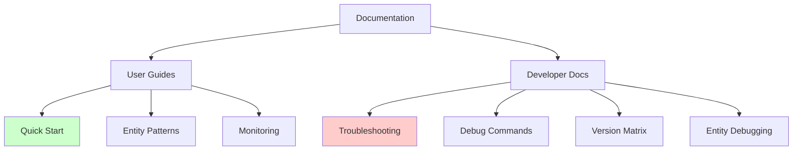

# FalkorDB Documentation

Comprehensive documentation for debugging and operating FalkorDB with Graphiti integration for personal knowledge management.

## 🚨 Critical Information

**⚠️ ACTIVE REGRESSION**: Graphiti versions 0.17.10+ have a critical bug preventing FalkorDB integration.  
**✅ SOLUTION**: Use Graphiti v0.17.9 - `pip install 'graphiti-core[falkordb]==0.17.9'`

See [TROUBLESHOOTING.md](dev/TROUBLESHOOTING.md#group_id-redisearch-error-active-regression) for immediate fix.

## 📚 Documentation Structure



## 🚀 User Documentation

Documentation for using FalkorDB as a personal knowledge management system.

### [📖 Visual Quick Start Guide](user/quickstart-visual.md)
**Start Here!** - Get up and running in minutes with visual guides
- System setup with diagrams
- First connection test
- Creating your first entity
- Browser UI access
- Health check dashboard

### [🎨 Entity Patterns Visual Library](user/entity-patterns-visual.md)
Working patterns for creating custom entities
- Design principles with visual examples
- Domain-specific patterns (Arabic, GTD, Islamic Finance)
- Common anti-patterns to avoid
- Testing templates

### [📊 Monitoring Dashboard Guide](user/monitoring-dashboard.md)
Monitor your knowledge management system
- Real-time monitoring scripts
- Performance metrics visualization
- Backup status tracking
- Alert thresholds and best practices

## 🛠 Developer Documentation

Technical documentation for debugging and maintaining the system.

### [🔧 Troubleshooting Guide](dev/TROUBLESHOOTING.md) **PRIORITY**
**Critical for current users** - Comprehensive troubleshooting for all issues
- group_id RediSearch error fix (v0.17.10+ regression)
- Connection debugging flowcharts
- Entity validation failures
- Performance optimization

### [🐛 Entity Debugging Visual Guide](dev/entity-debugging-visual.md)
Visual debugging for custom entity issues
- Entity processing pipeline diagrams
- Domain-specific debugging flows
- Field type compatibility matrix
- Step-by-step debug workflows

### [📋 Version Compatibility Matrix](dev/version-compatibility-matrix.md)
Detailed version compatibility information
- Complete version testing results
- Compatibility tables and timeline
- Installation commands by version
- Migration guides

### [⌨️ Debug Commands Reference](dev/debug-commands-reference.md)
Quick lookup for all debugging commands
- Connection debugging commands
- Graph operations
- Entity testing
- Performance monitoring
- Copy-paste ready snippets

## 🗺 Quick Navigation by Problem

### "I'm getting a group_id error"
→ [TROUBLESHOOTING.md - group_id fix](dev/TROUBLESHOOTING.md#group_id-redisearch-error-active-regression)

### "I need to set up FalkorDB"
→ [Quick Start Guide](user/quickstart-visual.md)

### "My custom entities aren't working"
→ [Entity Debugging Visual](dev/entity-debugging-visual.md)  
→ [Entity Patterns Library](user/entity-patterns-visual.md)

### "I need to monitor performance"
→ [Monitoring Dashboard](user/monitoring-dashboard.md)

### "What version should I use?"
→ [Version Compatibility Matrix](dev/version-compatibility-matrix.md)

### "I need a specific debug command"
→ [Debug Commands Reference](dev/debug-commands-reference.md)

## 📊 Documentation Coverage

| Domain | User Docs | Dev Docs | Visual Guides |
|--------|-----------|----------|---------------|
| **Setup & Installation** | ✅ Quick Start | ✅ Version Matrix | ✅ Flowcharts |
| **Entity Management** | ✅ Patterns Library | ✅ Debug Guide | ✅ Diagrams |
| **Troubleshooting** | ✅ Common Issues | ✅ Full Guide | ✅ Decision Trees |
| **Monitoring** | ✅ Dashboard Guide | ✅ Commands | ✅ Status Visuals |
| **Version Issues** | ✅ Workarounds | ✅ Compatibility | ✅ Timeline |

## 🎯 Purpose & Philosophy

This documentation is designed for:
- **Immediate problem solving** - Start with the most critical issues
- **Visual learning** - Extensive use of diagrams and flowcharts
- **Copy-paste solutions** - Ready-to-use commands and code
- **Progressive disclosure** - Quick fixes first, deep dives when needed

## 🔄 Documentation Updates

Last Updated: January 2025

Recent Changes:
- Added comprehensive troubleshooting for v0.17.10+ regression
- Created visual debugging guides for entity issues
- Added monitoring dashboard with real-time scripts
- Complete command reference for debugging

## 🚦 Quick Status Check

Run this to verify your system:
```bash
#!/bin/bash
echo "🏥 Quick System Check"
echo "===================="

# Check Docker
docker ps | grep -q falkordb && echo "✅ Docker: Running" || echo "❌ Docker: Not running"

# Check FalkorDB
docker exec falkordb redis-cli ping 2>/dev/null | grep -q PONG && echo "✅ FalkorDB: Responding" || echo "❌ FalkorDB: Not responding"

# Check Graphiti version
VERSION=$(python -c "import graphiti_core; print(graphiti_core.__version__)" 2>/dev/null)
if [ "$VERSION" = "0.17.9" ]; then
    echo "✅ Graphiti: v$VERSION (correct)"
else
    echo "❌ Graphiti: v$VERSION (need v0.17.9)"
fi
```

## 📝 Contributing to Documentation

Found an issue or have a suggestion? The documentation lives in `/docs/`:
- User guides: `/docs/user/`
- Developer docs: `/docs/dev/`
- This index: `/docs/README.md`

## 🔗 External Resources

- [Graphiti Repository](https://github.com/getzep/graphiti) - Issue #841 for regression
- [FalkorDB Documentation](https://docs.falkordb.com/)
- [Project README](../README.md) - Main project documentation

---

**Remember**: Always use Graphiti v0.17.9 until the regression is fixed!