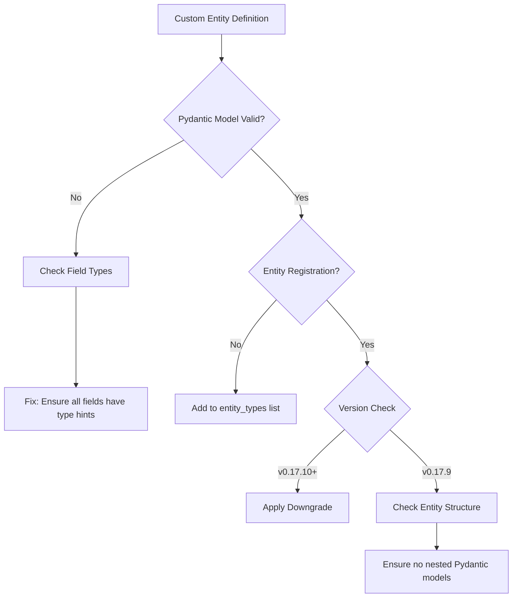
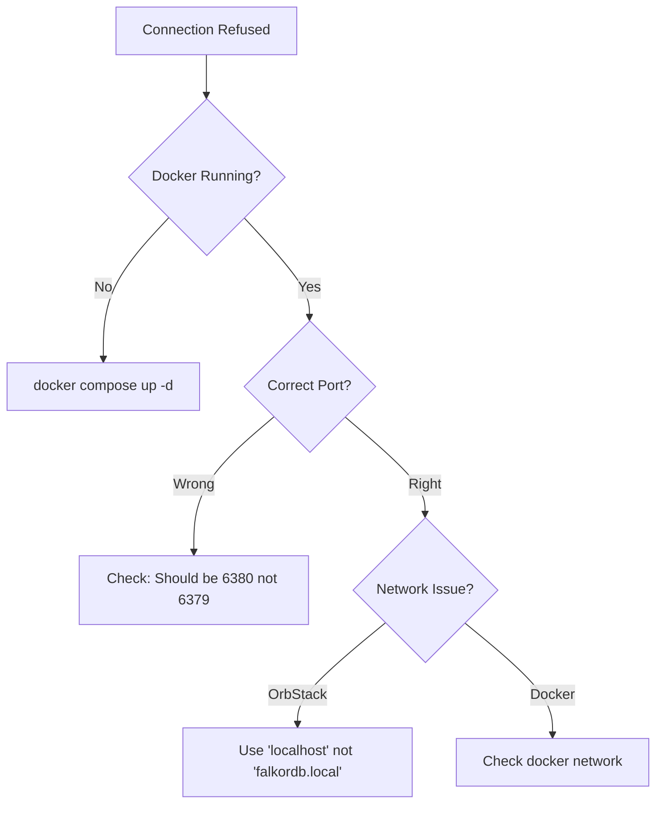
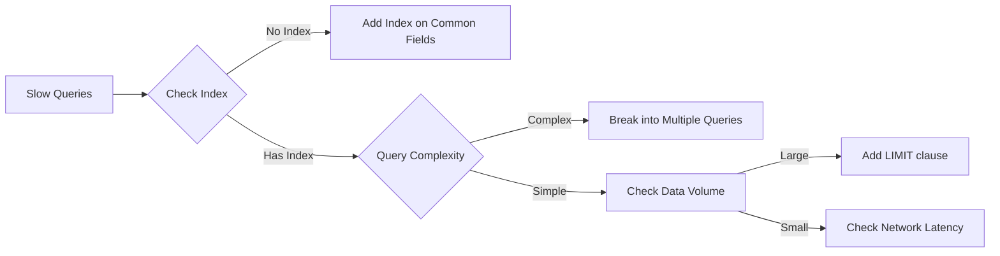

# FalkorDB-Graphiti Troubleshooting Guide

## 🚨 Critical Known Issues

### group_id RediSearch Error (ACTIVE REGRESSION)

**Status**: ❌ BROKEN in v0.17.10+ | ✅ WORKING in v0.17.9  
**Impact**: Complete blocker for ALL FalkorDB operations  
**Error Message**: `RediSearch: Syntax error at offset 12 near group_id`

#### Quick Fix (Immediate Workaround)
```bash
# Downgrade to last working version
pip uninstall graphiti-core
pip install 'graphiti-core[falkordb]==0.17.9'

# Verify version
pip show graphiti-core | grep Version
# Should show: Version: 0.17.9
```

#### Diagnosis Flowchart
```mermaid
graph TD
    A[Error: group_id RediSearch] --> B{Check Graphiti Version}
    B -->|v0.17.10 or higher| C[DOWNGRADE REQUIRED]
    B -->|v0.17.9 or lower| D[Check Other Issues]
    C --> E[pip install 'graphiti-core[falkordb]==0.17.9']
    E --> F[Restart Application]
    F --> G[Test Connection]
    G -->|Still Fails| H[Check FalkorDB Status]
    G -->|Works| I[✅ Fixed]
    H --> J[docker exec falkordb redis-cli ping]
```

---

## 🔍 Quick Diagnosis Commands

### 1. Test Basic Connection
```bash
# Check if FalkorDB is running
docker compose ps

# Test Redis protocol connection
docker exec falkordb redis-cli ping
# Expected: PONG

# List existing graphs
docker exec falkordb redis-cli GRAPH.LIST
# Expected: List of graph names or empty
```

### 2. Test Graphiti Integration
```bash
# Run minimal test (will show group_id error if affected)
cd /Users/adeel/Documents/1_projects/falkordb
python tests/test_minimal_group_id_repro.py

# Check current Graphiti version
python -c "import graphiti_core; print(graphiti_core.__version__)"
```

### 3. Monitor Real-time Queries
```bash
# Watch what queries Graphiti sends to FalkorDB
docker exec -it falkordb redis-cli MONITOR
# Then run your application in another terminal
# Look for queries containing "group_id" - these will fail in v0.17.10+
```

---

## 📊 Common Error Patterns

### 1. Entity Validation Failures

#### Symptom: Custom Entities Not Being Extracted
```python
# Error pattern
AttributeError: 'NoneType' object has no attribute 'entity_types'
```

#### Visual Debug Flow


#### Fix for Arabic Entities
```python
# ❌ WRONG: Nested Pydantic models
class LearningSession(BaseModel):
    student: Student  # This will fail
    
# ✅ CORRECT: Use primitive types or Optional
class LearningSession(BaseModel):
    student_id: str
    student_name: Optional[str] = None
```

#### Fix for GTD Entities  
```python
# ❌ WRONG: Complex enum in lists
tasks: List[TaskStatus]  # May fail serialization

# ✅ CORRECT: Use string representation
task_statuses: List[str]  # Works reliably
```

---

### 2. Connection Issues

#### Connection Refused Error


#### Quick Fixes by Error Type

| Error | Command to Fix | Verify With |
|-------|---------------|-------------|
| Connection refused | `docker compose up -d` | `docker ps \| grep falkordb` |
| Wrong port | Use port `6380` in code | `netstat -an \| grep 6380` |
| Network unreachable | `docker compose down && docker compose up -d` | `docker exec falkordb redis-cli ping` |
| Auth failed | Remove password from connection | Check docker-compose.yml |

---

### 3. Schema Migration Issues

#### When Custom Entities Change Structure
```bash
# Clear the graph and rebuild
docker exec falkordb redis-cli GRAPH.DELETE shared_knowledge_graph

# In Python, rebuild indices
from graphiti_core.utils.maintenance.graph_data_operations import clear_data
await clear_data(client.driver)
await client.build_indices_and_constraints()
```

---

## 🚀 Performance Issues

### Slow Query Diagnosis
```bash
# Check slow queries
docker exec falkordb redis-cli SLOWLOG GET 10

# Monitor memory usage
docker exec falkordb redis-cli INFO memory | grep used_memory_human

# If memory > 3GB, increase limit in docker-compose.yml:
# --maxmemory 8gb
```

### Query Optimization Patterns


---

## 💡 Quick Reference: Error to Solution

| Error Message | Most Likely Cause | Quick Fix |
|--------------|-------------------|-----------|
| `group_id RediSearch error` | Graphiti v0.17.10+ bug | Downgrade to v0.17.9 |
| `Connection refused` | FalkorDB not running | `docker compose up -d` |
| `Graph.QUERY timeout` | Large result set | Add LIMIT to query |
| `Invalid entity format` | Pydantic validation | Check type hints |
| `Module not found: graphiti_core` | Missing dependency | `pip install graphiti-core[falkordb]==0.17.9` |
| `redis.exceptions.ResponseError` | Wrong Redis command | Use GRAPH.* commands |
| `Port 6379 already in use` | Conflict with Redis | Use port 6380 |

---

## 🔧 Testing Commands

### Verify Everything is Working
```bash
# 1. Test FalkorDB
docker exec falkordb redis-cli ping

# 2. Test Graphiti version
python -c "import graphiti_core; print('Version:', graphiti_core.__version__)"

# 3. Run basic test
python tests/test_basic_connection.py

# 4. Run custom entity test
python tests/test_custom_entities_basic.py -k arabic -v

# If all pass, system is ready
```

### When Nothing Else Works
```bash
# Nuclear option - complete reset
docker compose down -v  # Remove volumes too
rm -rf venv/
python -m venv venv
source venv/bin/activate  # or venv\Scripts\activate on Windows
pip install -r tests/requirements.txt
pip install 'graphiti-core[falkordb]==0.17.9'  # Use working version
docker compose up -d
python tests/test_basic_connection.py
```

---

## 📚 See Also

- [Entity Debugging Visual Guide](entity-debugging-visual.md) - Visual diagrams for entity issues
- [Version Compatibility Matrix](version-compatibility-matrix.md) - Which versions work together
- [Debug Commands Reference](debug-commands-reference.md) - Complete command reference