# Entity Debugging Visual Guide

Visual diagrams and flowcharts for debugging custom entity issues in FalkorDB with Graphiti.

## Entity Processing Pipeline

```mermaid
graph TD
    A[Entity Definition<br/>Python Class] --> B[Pydantic Validation]
    B -->|✅ Pass| C[Graphiti Entity Extraction]
    B -->|❌ Fail| D[ValidationError]
    C --> E[FalkorDB Schema Mapping]
    E -->|✅ Match| F[Node Creation]
    E -->|❌ Mismatch| G[group_id Error<br/>v0.17.10+]
    F --> H[Graph Storage]
    G --> I[Downgrade Fix]
    D --> J[Fix Type Hints]
    
    style D fill:#ffcccc
    style G fill:#ffcccc
    style F fill:#ccffcc
    style H fill:#ccffcc
```



## Domain-Specific Entity Debugging

### Arabic Learning Domain

```mermaid
graph LR
    A[Arabic Entity] --> B{Entity Type?}
    B -->|Student| C[Check Fields]
    B -->|Lesson| D[Check Fields]
    B -->|Vocabulary| E[Check Fields]
    
    C --> F{name: str?<br/>level: ProficiencyLevel?<br/>skills: List?}
    D --> G{topic: str?<br/>duration: int?<br/>difficulty: str?}
    E --> H{word: str?<br/>translation: str?<br/>root: Optional[str]?}
    
    F -->|Missing| I[Add Type Hints]
    G -->|Wrong Type| J[Fix Type]
    H -->|Complex Type| K[Simplify to Primitives]
```

### GTD (Getting Things Done) Domain

```mermaid
flowchart TD
    A[GTD Entity] --> B{Task or Project?}
    B -->|Task| C[Task Validation]
    B -->|Project| D[Project Validation]
    
    C --> E{Check Required Fields}
    E -->|description: str| F[✓]
    E -->|context: str| G[✓]
    E -->|priority: Priority| H[✓]
    
    D --> I{Check Relationships}
    I -->|tasks: List[Task]| J[❌ Nested Models]
    I -->|task_ids: List[str]| K[✅ Use IDs]
    
    J --> L[Flatten Structure]
    K --> M[Success]
    
    style J fill:#ffcccc
    style K fill:#ccffcc
    style M fill:#ccffcc
```

### Islamic Finance Domain

```mermaid
graph TD
    A[Islamic Finance Entity] --> B{Valid Account Type?}
    B -->|WADIAH| C[Current Account]
    B -->|MUDARABAH| D[Savings Account]
    B -->|Unknown| E[❌ Invalid Type]
    
    C --> F{Required Fields}
    D --> F
    F -->|account_name: str| G[✓]
    F -->|balance: float| H[✓]
    F -->|currency: str| I[✓]
    
    E --> J[Check AccountType Enum]
    J --> K[Add to Enum Definition]
    
    G & H & I --> L[Validate Relationships]
    L --> M{Has Transactions?}
    M -->|List[Transaction]| N[❌ Complex Nesting]
    M -->|List[str] IDs| O[✅ Reference by ID]
    
    style E fill:#ffcccc
    style N fill:#ffcccc
    style O fill:#ccffcc
```

## Common Entity Error Patterns

### Error Type Decision Tree


## Entity Registration Flow


## Field Type Compatibility Matrix

```mermaid
graph LR
    subgraph Python Types
        A1[str]
        A2[int]
        A3[float]
        A4[bool]
        A5[List]
        A6[Dict]
        A7[BaseModel]
        A8[Enum]
    end
    
    subgraph FalkorDB Types
        B1[STRING]
        B2[INTEGER]
        B3[FLOAT]
        B4[BOOLEAN]
        B5[ARRAY]
        B6[MAP]
    end
    
    A1 -->|✅| B1
    A2 -->|✅| B2
    A3 -->|✅| B3
    A4 -->|✅| B4
    A5 -->|✅| B5
    A6 -->|⚠️| B6
    A7 -->|❌| B1
    A8 -->|Convert| B1
    
    style A7 fill:#ffcccc
    style A6 fill:#ffffcc
```



## Debugging Workflow

### Step-by-Step Entity Debug Process

```mermaid
flowchart TB
    Start([Entity Not Working]) --> Check1{Entity Defined?}
    Check1 -->|No| Define[Define Entity Class<br/>with BaseModel]
    Check1 -->|Yes| Check2{Type Hints<br/>Present?}
    
    Check2 -->|No| AddTypes[Add Type Hints<br/>to All Fields]
    Check2 -->|Yes| Check3{Registered in<br/>entity_types?}
    
    Check3 -->|No| Register[Add to<br/>ENTITY_TYPES list]
    Check3 -->|Yes| Check4{Test Locally?}
    
    Check4 -->|No| TestLocal[Run<br/>test_custom_entities_basic.py]
    Check4 -->|Yes| Check5{Version Check}
    
    Check5 -->|v0.17.10+| Downgrade[pip install<br/>'graphiti-core[falkordb]==0.17.9']
    Check5 -->|v0.17.9| Check6{Complex Types?}
    
    Check6 -->|Yes| Simplify[Convert to<br/>Primitive Types]
    Check6 -->|No| Check7{Relationships?}
    
    Check7 -->|Nested| UseIDs[Use ID References<br/>Instead of Objects]
    Check7 -->|Simple| Success([Entity Should Work])
    
    Define --> Check2
    AddTypes --> Check3
    Register --> Check4
    TestLocal --> Check5
    Downgrade --> Success
    Simplify --> Check7
    UseIDs --> Success
    
    style Downgrade fill:#ffffcc
    style Success fill:#ccffcc
```

## Quick Visual Fixes

### Converting Complex to Simple Types

```mermaid
graph LR
    subgraph "❌ Complex (Fails)"
        A[class Task<br/>student: Student<br/>project: Project]
    end
    
    subgraph "✅ Simple (Works)"
        B[class Task<br/>student_id: str<br/>project_name: str]
    end
    
    A -->|Transform| B
    
    style A fill:#ffcccc
    style B fill:#ccffcc
```



### Entity Relationship Patterns

```mermaid
graph TD
    subgraph "❌ Direct Nesting"
        A1[Project] --> A2[List of Task Objects]
        A2 --> A3[Serialization Fails]
    end
    
    subgraph "✅ ID References"
        B1[Project] --> B2[List of task_ids]
        B2 --> B3[Separate Task Nodes]
        B3 --> B4[Link by ID]
    end
    
    style A3 fill:#ffcccc
    style B4 fill:#ccffcc
```



## Testing Entity Extraction

### Visual Test Flow


## Common Solutions Summary

| Visual Symptom | Problem | Quick Fix |
|---------------|---------|-----------|
| 🔴 Red validation error | Type hint missing | Add `: str`, `: int`, etc. |
| 🟡 Yellow warning | Complex nested type | Flatten to primitives |
| 🔴 group_id error | Version regression | Use v0.17.9 |
| 🟠 No entities extracted | Not registered | Add to entity_types |
| 🔴 Serialization error | Pydantic in Pydantic | Use IDs not objects |
| 🟡 Slow extraction | Too many relationships | Batch process |

---

## See Also

- [TROUBLESHOOTING.md](TROUBLESHOOTING.md) - General troubleshooting guide
- [Version Compatibility Matrix](version-compatibility-matrix.md) - Version compatibility details
- [Entity Patterns Visual](../user/entity-patterns-visual.md) - Working entity examples