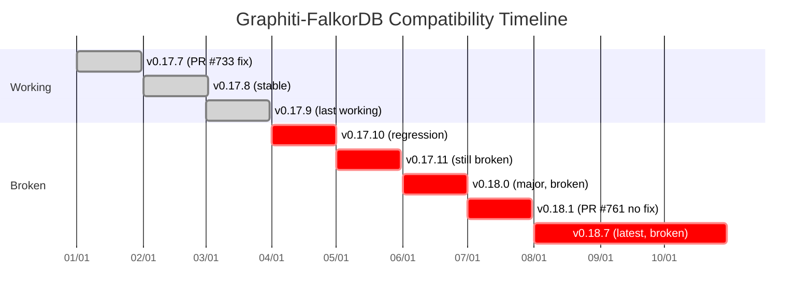
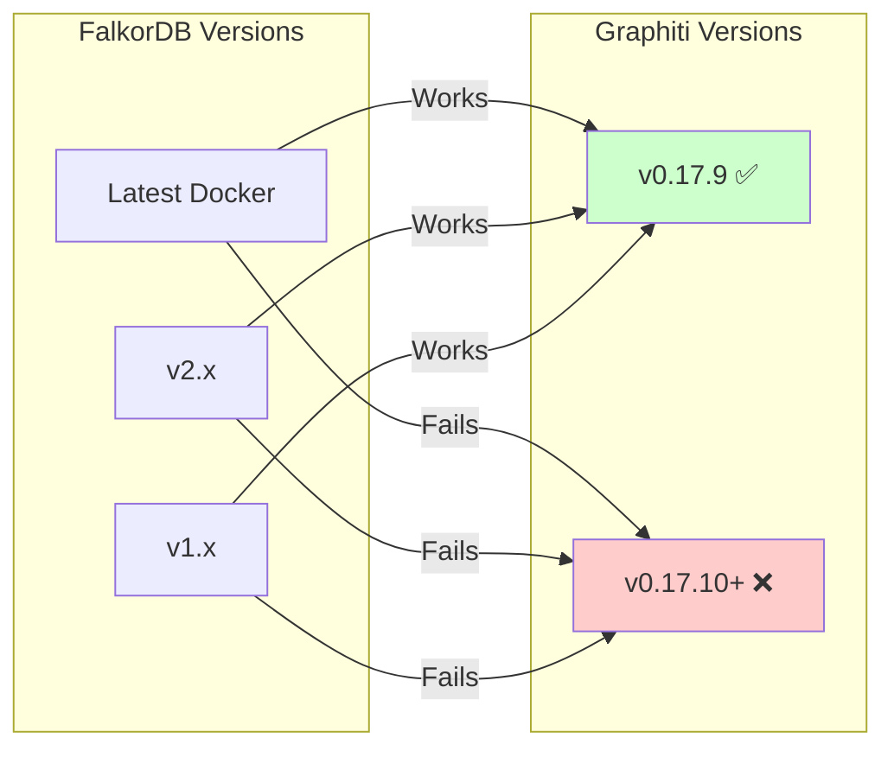
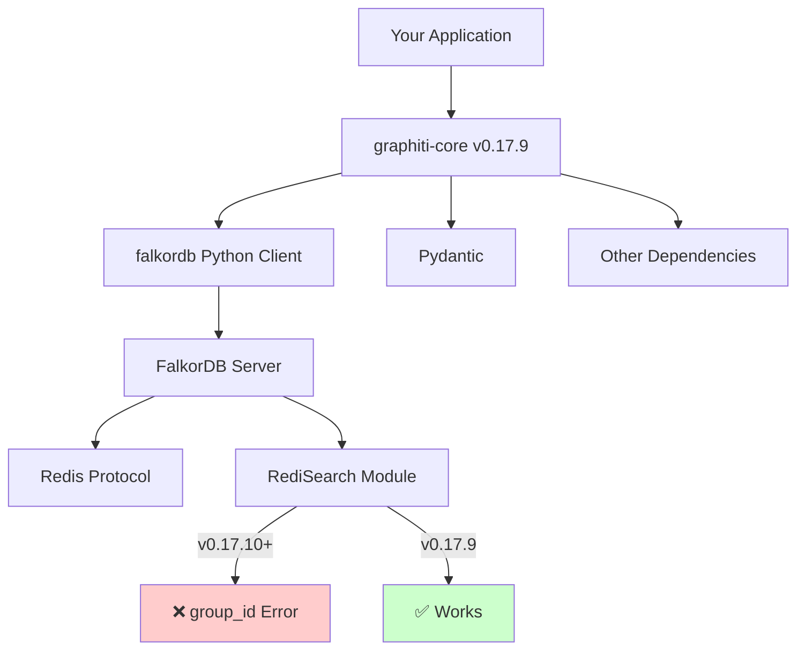
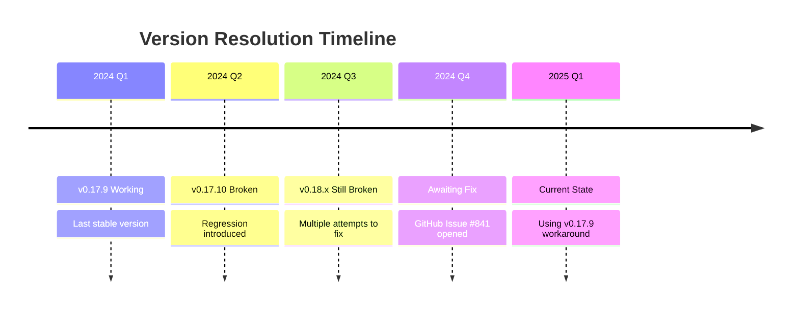

# Version Compatibility Matrix

## Critical Version Information

⚠️ **ACTIVE REGRESSION**: Graphiti v0.17.10+ breaks FalkorDB compatibility  
✅ **RECOMMENDED VERSION**: `graphiti-core[falkordb]==0.17.9`

## Compatibility Matrix Overview



## Detailed Compatibility Table

| Graphiti Version | FalkorDB | Status | Custom Entities | Arabic | GTD | Islamic Finance | Notes |
|-----------------|----------|---------|-----------------|--------|-----|-----------------|-------|
| **v0.17.7** | ✅ All | ✅ Working | ✅ | ✅ | ✅ | ✅ | PR #733 fixed group_id |
| **v0.17.8** | ✅ All | ✅ Working | ✅ | ✅ | ✅ | ✅ | Stable release |
| **v0.17.9** | ✅ All | ✅ Working | ✅ | ✅ | ✅ | ✅ | **RECOMMENDED** |
| v0.17.10 | ❌ All | ❌ BROKEN | ❌ | ❌ | ❌ | ❌ | Regression introduced |
| v0.17.11 | ❌ All | ❌ BROKEN | ❌ | ❌ | ❌ | ❌ | Not fixed |
| v0.18.0 | ❌ All | ❌ BROKEN | ❌ | ❌ | ❌ | ❌ | Major version, still broken |
| v0.18.1 | ❌ All | ❌ BROKEN | ❌ | ❌ | ❌ | ❌ | PR #761 didn't fix |
| v0.18.7 | ❌ All | ❌ BROKEN | ❌ | ❌ | ❌ | ❌ | Latest, still broken |

## Component Compatibility

### FalkorDB Versions


### Python Version Compatibility

| Python | Graphiti v0.17.9 | Graphiti v0.18.x | FalkorDB Client | Status |
|--------|------------------|-------------------|-----------------|---------|
| 3.8 | ✅ | ✅ | ✅ | Works with v0.17.9 only |
| 3.9 | ✅ | ✅ | ✅ | Works with v0.17.9 only |
| 3.10 | ✅ | ✅ | ✅ | Works with v0.17.9 only |
| 3.11 | ✅ | ✅ | ✅ | Works with v0.17.9 only |
| 3.12 | ✅ | ✅ | ✅ | Works with v0.17.9 only |
| 3.13 | ✅ | ⚠️ | ✅ | **Tested & Working** with v0.17.9 |

## Dependency Tree



## Version Feature Comparison

| Feature | v0.17.9 ✅ | v0.17.10+ ❌ |
|---------|------------|--------------|
| Basic Queries | ✅ Working | ❌ group_id error |
| Custom Entities | ✅ Full support | ❌ Fails on creation |
| Entity Extraction | ✅ All domains | ❌ None work |
| Search Operations | ✅ RediSearch OK | ❌ RediSearch syntax error |
| Graph Creation | ✅ Success | ❌ Fails at index |
| Relationship Creation | ✅ Working | ❌ Can't reach this step |
| Episode Addition | ✅ Complete | ❌ Blocked by group_id |
| Index Building | ✅ Successful | ❌ Error at build |

## Installation Commands by Version

### ✅ Working Version (RECOMMENDED)
```bash
# Clean install of working version
pip uninstall graphiti-core -y
pip install 'graphiti-core[falkordb]==0.17.9'

# Verify installation
python -c "import graphiti_core; print(graphiti_core.__version__)"
# Should output: 0.17.9
```

### ❌ Broken Versions (AVOID)
```bash
# These will cause group_id errors:
pip install 'graphiti-core[falkordb]==0.17.10'  # ❌ First broken
pip install 'graphiti-core[falkordb]==0.17.11'  # ❌ Still broken
pip install 'graphiti-core[falkordb]==0.18.0'   # ❌ Major, broken
pip install 'graphiti-core[falkordb]==0.18.1'   # ❌ PR #761 no help
pip install 'graphiti-core[falkordb]'           # ❌ Latest is broken
```

## Testing Version Compatibility

### Quick Version Test Script
```python
#!/usr/bin/env python3
"""test_version.py - Quick version compatibility test"""

import asyncio
from graphiti_core import Graphiti
from graphiti_core.driver.falkordb_driver import FalkorDriver
import graphiti_core

async def test_version():
    version = graphiti_core.__version__
    print(f"Testing Graphiti {version}")
    
    driver = FalkorDriver(
        host="localhost",
        port=6380,
        database="version_test"
    )
    
    client = Graphiti(graph_driver=driver)
    
    try:
        await client.build_indices_and_constraints()
        print(f"✅ Version {version} WORKS")
        return True
    except Exception as e:
        if "group_id" in str(e):
            print(f"❌ Version {version} BROKEN - group_id error")
        else:
            print(f"❌ Version {version} FAILED - {e}")
        return False

if __name__ == "__main__":
    asyncio.run(test_version())
```

## Version Migration Guide

### Downgrading from Broken Version

```mermaid
flowchart LR
    A[Detect group_id Error] --> B[Check Current Version]
    B --> C{Version >= 0.17.10?}
    C -->|Yes| D[Backup Current Code]
    C -->|No| E[Different Issue]
    D --> F[pip uninstall graphiti-core]
    F --> G[pip install 'graphiti-core[falkordb]==0.17.9']
    G --> H[Update requirements.txt]
    H --> I[Pin version in code]
    I --> J[Test Connection]
    J --> K[✅ Working]
```

### requirements.txt Examples

```bash
# ✅ GOOD - Pinned to working version
graphiti-core[falkordb]==0.17.9

# ❌ BAD - Will install broken version
graphiti-core[falkordb]
graphiti-core[falkordb]>=0.17.10
graphiti-core[falkordb]~=0.18.0
```

## Docker Compose Compatibility

### FalkorDB Configuration
```yaml
# Works with ALL FalkorDB versions when using Graphiti v0.17.9
services:
  falkordb:
    image: falkordb/falkordb:latest  # ✅ Works
    # image: falkordb/falkordb:v2.0   # ✅ Also works
    # image: falkordb/falkordb:v1.0   # ✅ Also works
    ports:
      - "6380:6379"  # Using 6380 to avoid conflicts
```

## Known Issues by Version

### v0.17.10 - v0.18.7
- **Issue**: RediSearch syntax error with group_id parameter
- **Error**: `RediSearch: Syntax error at offset 12 near group_id`
- **Impact**: Complete failure of all FalkorDB operations
- **Workaround**: Downgrade to v0.17.9

### v0.17.9 and Earlier
- **Status**: Fully functional
- **Known Issues**: None with FalkorDB
- **Custom Entities**: Full support for all domains

## Future Version Planning



---

## Quick Reference

| Need | Use This Version | Command |
|------|-----------------|---------|
| **Production** | v0.17.9 | `pip install 'graphiti-core[falkordb]==0.17.9'` |
| **Development** | v0.17.9 | `pip install 'graphiti-core[falkordb]==0.17.9'` |
| **Testing** | v0.17.9 | `pip install 'graphiti-core[falkordb]==0.17.9'` |
| **Latest Features** | Not Available | Must wait for fix in future version |

---

## See Also

- [TROUBLESHOOTING.md](TROUBLESHOOTING.md) - How to diagnose and fix issues
- [Entity Debugging Visual](entity-debugging-visual.md) - Visual debugging guide
- [Debug Commands Reference](debug-commands-reference.md) - Complete command reference