# Entity Patterns Visual Library

Working patterns and examples for creating custom entities across different knowledge domains.

## Entity Design Principles

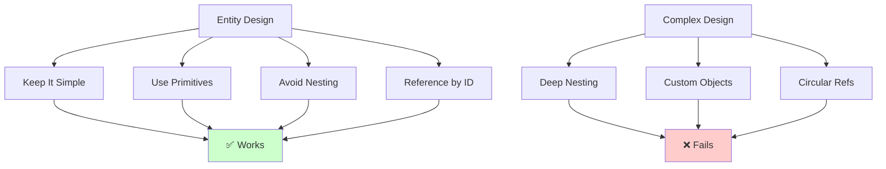

## Working Entity Patterns

### Pattern 1: Simple Flat Entity

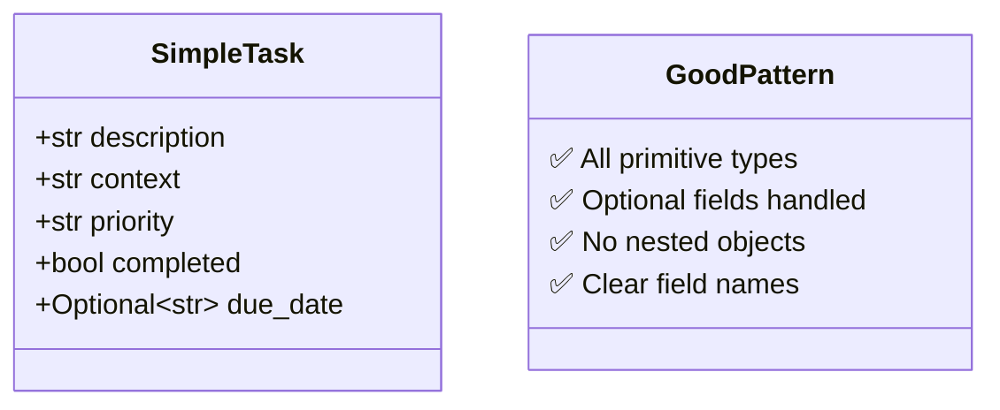

**Implementation:**
```python
from pydantic import BaseModel, Field
from typing import Optional

class SimpleTask(BaseModel):
    """✅ WORKS: Simple, flat structure"""
    description: str = Field(..., description="Task description")
    context: str = Field(default="@anywhere")
    priority: str = Field(default="medium")
    completed: bool = Field(default=False)
    due_date: Optional[str] = Field(default=None)
```

### Pattern 2: Entity with Enum

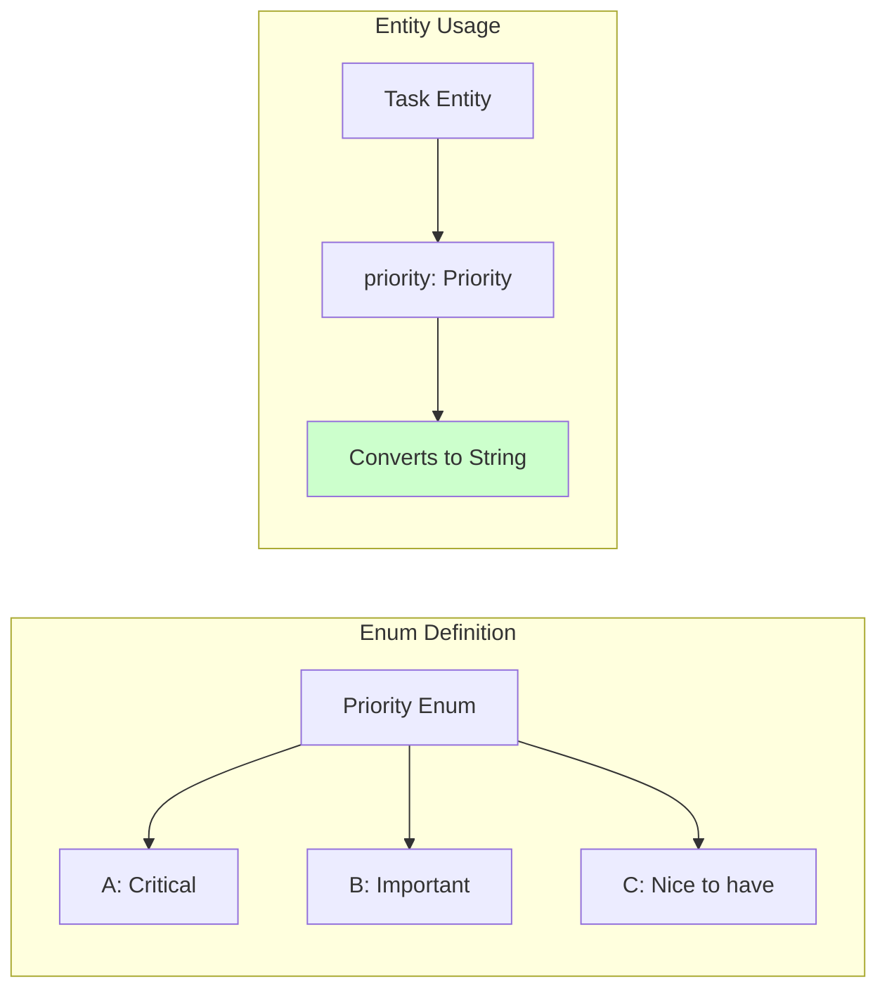

**Implementation:**
```python
from enum import Enum

class Priority(str, Enum):
    """✅ WORKS: String-based enum"""
    A = "A"
    B = "B"
    C = "C"
    
class TaskWithEnum(BaseModel):
    description: str
    priority: Priority = Priority.B  # ✅ Works
```

### Pattern 3: Entity with References

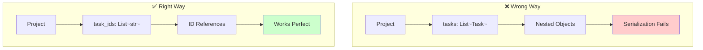

**Implementation:**
```python
# ❌ WRONG: Nested entities
class ProjectWrong(BaseModel):
    name: str
    tasks: List[Task]  # This will fail!

# ✅ CORRECT: ID references
class ProjectRight(BaseModel):
    name: str
    task_ids: List[str] = Field(default_factory=list)
    task_count: int = Field(default=0)
```

## Domain-Specific Patterns

### Arabic Learning Domain

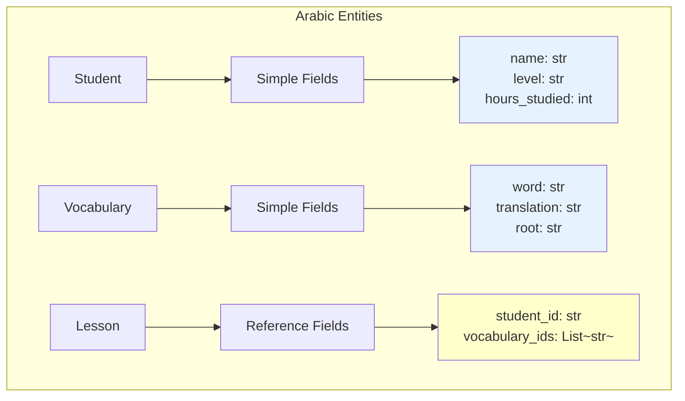

**Working Implementation:**
```python
class Student(BaseModel):
    """✅ Arabic learning student entity"""
    name: str
    level: str = "beginner"  # beginner, intermediate, advanced
    hours_studied: int = 0
    skills: List[str] = Field(default_factory=list)  # ["reading", "writing"]

class Vocabulary(BaseModel):
    """✅ Arabic vocabulary entity"""
    word: str
    translation: str
    root: Optional[str] = None
    difficulty: int = Field(ge=1, le=10, default=5)

class LearningSession(BaseModel):
    """✅ Session linking students and vocabulary"""
    session_id: str = Field(default_factory=lambda: str(uuid.uuid4()))
    student_id: str  # Reference to student
    vocabulary_ids: List[str] = Field(default_factory=list)  # References
    duration_minutes: int
    date: str  # ISO format date string
```

### GTD (Getting Things Done) Domain

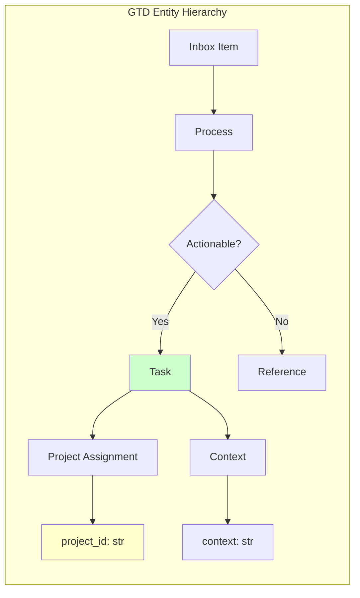

**Working Implementation:**
```python
class InboxItem(BaseModel):
    """✅ GTD inbox capture"""
    content: str
    captured_at: str  # ISO timestamp
    processed: bool = False

class Task(BaseModel):
    """✅ GTD next action"""
    description: str
    context: str = "@anywhere"  # @home, @office, @computer
    project_id: Optional[str] = None  # Reference to project
    energy_required: str = "medium"  # high, medium, low
    time_estimate_minutes: Optional[int] = None
    completed: bool = False
    
class Project(BaseModel):
    """✅ GTD project"""
    name: str
    outcome: str  # Desired outcome
    status: str = "active"  # active, someday, completed
    task_ids: List[str] = Field(default_factory=list)  # Task references
    review_date: Optional[str] = None
```

### Islamic Finance Domain

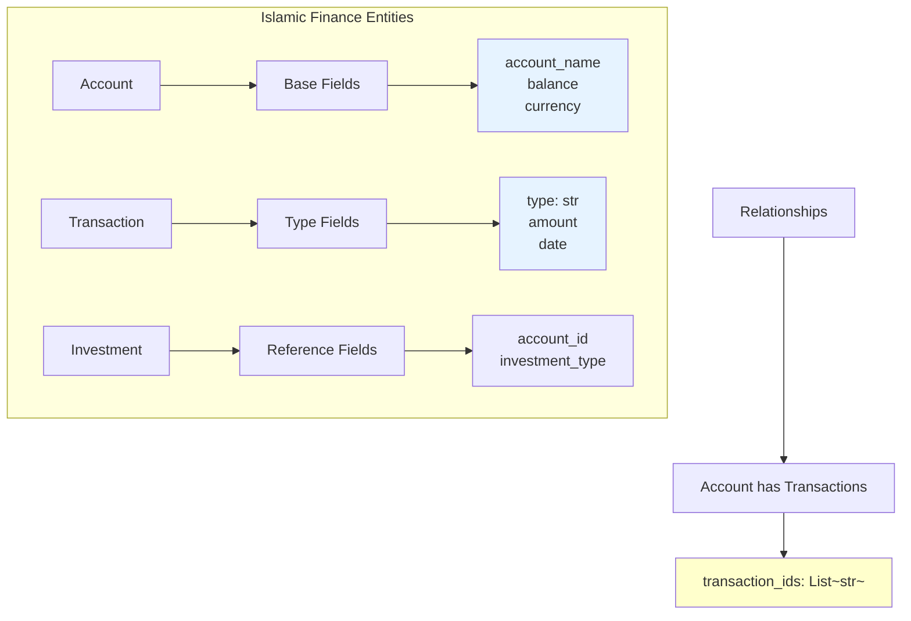

**Working Implementation:**
```python
class Account(BaseModel):
    """✅ Islamic finance account"""
    account_id: str = Field(default_factory=lambda: str(uuid.uuid4()))
    account_name: str
    account_type: str  # wadiah, mudarabah, musharakah
    institution: str
    balance: float = 0.0
    currency: str = "USD"
    opened_date: str  # ISO date

class Transaction(BaseModel):
    """✅ Shariah-compliant transaction"""
    transaction_id: str = Field(default_factory=lambda: str(uuid.uuid4()))
    account_id: str  # Reference to account
    transaction_type: str  # murabahah, ijarah, salam
    amount: float
    date: str  # ISO date
    description: str
    halal_certified: bool = True

class Investment(BaseModel):
    """✅ Islamic investment"""
    investment_id: str = Field(default_factory=lambda: str(uuid.uuid4()))
    account_id: str  # Reference to account
    investment_type: str  # sukuk, equity, gold
    amount: float
    expected_return_percentage: Optional[float] = None
    maturity_date: Optional[str] = None
```

## Entity Registration Pattern

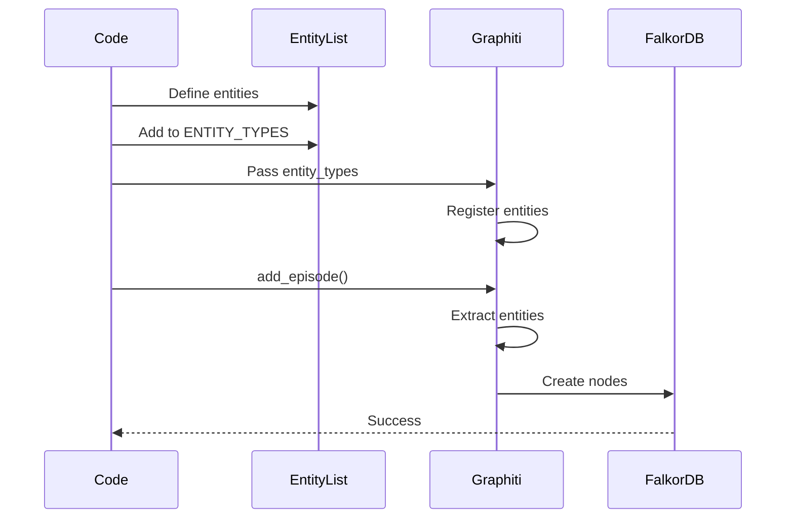

**Registration Code:**
```python
# entities/__init__.py
from typing import List, Type
from pydantic import BaseModel

# Import all entity classes
from .arabic_entities import Student, Vocabulary, LearningSession
from .gtd_entities import Task, Project, InboxItem
from .islamic_finance_entities import Account, Transaction, Investment

# ✅ Register all entities
ALL_ENTITY_TYPES: List[Type[BaseModel]] = [
    # Arabic domain
    Student,
    Vocabulary, 
    LearningSession,
    
    # GTD domain
    Task,
    Project,
    InboxItem,
    
    # Islamic Finance domain
    Account,
    Transaction,
    Investment,
]

# Usage with Graphiti
from graphiti_core import Graphiti

client = Graphiti(
    graph_driver=driver,
    entity_types=ALL_ENTITY_TYPES  # ✅ Pass all entities
)
```

## Common Anti-Patterns to Avoid

### Anti-Pattern 1: Nested Pydantic Models

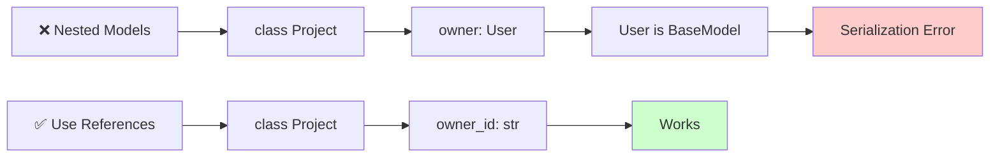

### Anti-Pattern 2: Circular References

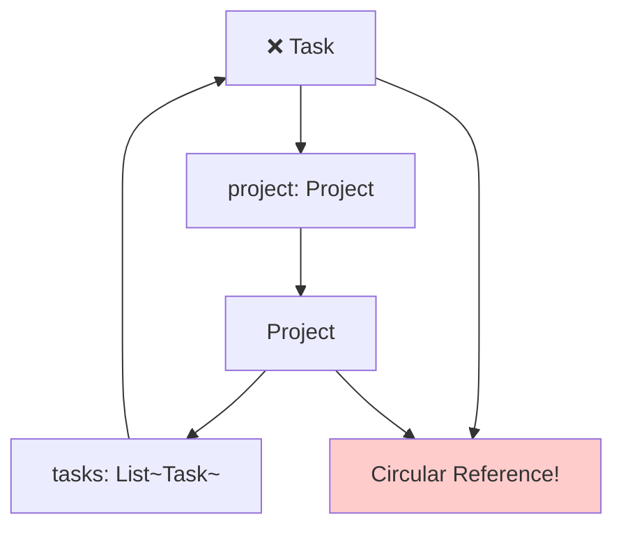

### Anti-Pattern 3: Complex Nested Structures

```python
# ❌ AVOID: Too complex
class ComplexEntity(BaseModel):
    data: Dict[str, List[Dict[str, Any]]]  # Too nested!
    
# ✅ PREFER: Flatten structure
class SimpleEntity(BaseModel):
    data_items: List[str]  # Store as JSON strings if needed
    metadata: Dict[str, str]  # Simple key-value pairs
```

## Testing Entity Patterns

### Test Template
```python
import asyncio
from graphiti_core import Graphiti
from graphiti_core.driver.falkordb_driver import FalkorDriver
from entities import ALL_ENTITY_TYPES

async def test_entities():
    """✅ Test entity extraction"""
    driver = FalkorDriver(
        host="localhost",
        port=6380,
        database="entity_test"
    )
    
    client = Graphiti(
        graph_driver=driver,
        entity_types=ALL_ENTITY_TYPES  # Register all
    )
    
    # Test episode with multiple domains
    episode = """
    Student Ahmed is at intermediate level studying Arabic.
    Task: Review Arabic vocabulary for tomorrow's lesson.
    Context: @home
    Priority: High
    
    Investment update: Sukuk investment of $10,000 in account.
    """
    
    result = await client.add_episode(
        name="Multi-domain test",
        episode_body=episode,
        source=EpisodeType.text
    )
    
    print(f"✅ Extracted {len(result.extracted_entities)} entities")

asyncio.run(test_entities())
```

## Quick Reference Card

| Pattern | Do ✅ | Don't ❌ |
|---------|-------|----------|
| **Types** | Use primitives (str, int, float, bool) | Use complex nested objects |
| **Lists** | `List[str]` for IDs | `List[CustomObject]` |
| **References** | Store entity IDs | Store entity objects |
| **Enums** | String-based enums | Complex enum types |
| **Optional** | `Optional[str] = None` | Required complex fields |
| **Dates** | ISO strings | datetime objects |
| **IDs** | UUID strings | Integer auto-increment |

## Visual Success Checklist

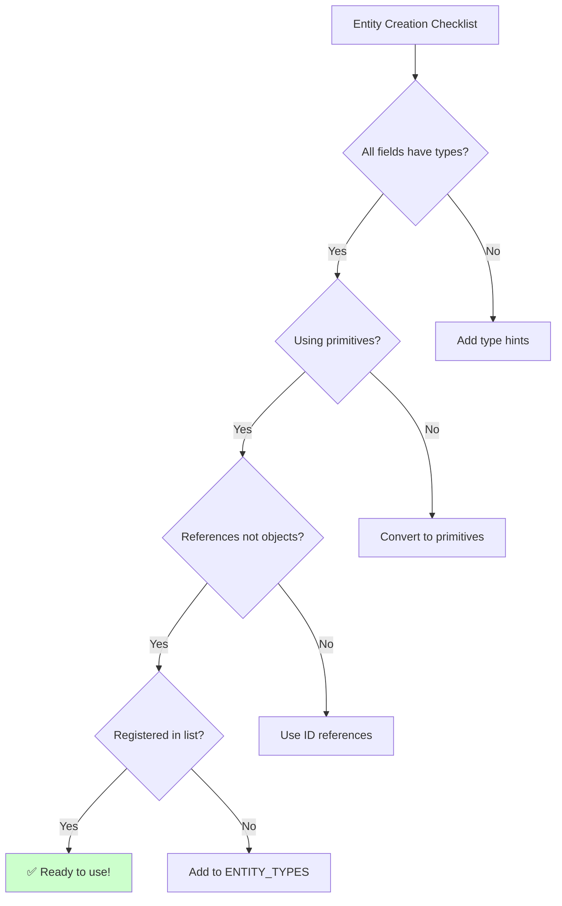

---

## See Also

- [Quick Start Guide](quickstart-visual.md) - Get started quickly
- [Entity Debugging](../dev/entity-debugging-visual.md) - Debug entity issues
- [Troubleshooting](../dev/TROUBLESHOOTING.md) - Fix common problems