# Monitoring Dashboard Guide

Visual guide for monitoring your FalkorDB personal knowledge management system.

## System Overview Dashboard


## Real-time Monitoring Script

### Visual Monitoring Flow


### The Monitoring Script
Save as `scripts/monitor.sh`:
```bash
#!/bin/bash

# Colors for visual output
RED='\033[0;31m'
GREEN='\033[0;32m'
YELLOW='\033[1;33m'
BLUE='\033[0;34m'
NC='\033[0m' # No Color

clear_screen() {
    clear
    echo -e "${BLUE}═══════════════════════════════════════════════════════════${NC}"
    echo -e "${BLUE}           FalkorDB Monitoring Dashboard                    ${NC}"
    echo -e "${BLUE}═══════════════════════════════════════════════════════════${NC}"
    echo ""
}

check_status() {
    # Docker Status
    if docker ps | grep -q falkordb; then
        echo -e "Docker:     ${GREEN}● Running${NC}"
    else
        echo -e "Docker:     ${RED}● Stopped${NC}"
        return 1
    fi
    
    # FalkorDB Status
    if docker exec falkordb redis-cli ping | grep -q PONG; then
        echo -e "FalkorDB:   ${GREEN}● Connected${NC}"
    else
        echo -e "FalkorDB:   ${RED}● Not Responding${NC}"
        return 1
    fi
    
    # Graphiti Version
    VERSION=$(python -c "import graphiti_core; print(graphiti_core.__version__)" 2>/dev/null)
    if [ "$VERSION" = "0.17.9" ]; then
        echo -e "Graphiti:   ${GREEN}● v$VERSION ✓${NC}"
    else
        echo -e "Graphiti:   ${YELLOW}● v$VERSION (need 0.17.9)${NC}"
    fi
}

show_metrics() {
    echo -e "\n${BLUE}═══ Performance Metrics ═══${NC}"
    
    # Memory Usage
    MEM=$(docker exec falkordb redis-cli INFO memory | grep used_memory_human | cut -d: -f2 | tr -d '\r')
    echo -e "Memory Used:    $MEM"
    
    # Graph Count
    GRAPHS=$(docker exec falkordb redis-cli GRAPH.LIST | wc -l)
    echo -e "Active Graphs:  $GRAPHS"
    
    # Uptime
    UPTIME=$(docker exec falkordb redis-cli INFO server | grep uptime_in_seconds | cut -d: -f2 | tr -d '\r')
    HOURS=$((UPTIME / 3600))
    MINUTES=$(((UPTIME % 3600) / 60))
    echo -e "Uptime:         ${HOURS}h ${MINUTES}m"
}

show_data_stats() {
    echo -e "\n${BLUE}═══ Data Statistics ═══${NC}"
    
    # Try to get node/edge count from main graph
    GRAPH_NAME="shared_knowledge_graph"
    
    NODE_COUNT=$(docker exec falkordb redis-cli GRAPH.QUERY $GRAPH_NAME "MATCH (n) RETURN count(n)" 2>/dev/null | grep -o '[0-9]*' | head -1)
    EDGE_COUNT=$(docker exec falkordb redis-cli GRAPH.QUERY $GRAPH_NAME "MATCH ()-[r]->() RETURN count(r)" 2>/dev/null | grep -o '[0-9]*' | head -1)
    
    echo -e "Graph:          $GRAPH_NAME"
    echo -e "Total Nodes:    ${NODE_COUNT:-0}"
    echo -e "Total Edges:    ${EDGE_COUNT:-0}"
}

show_recent_activity() {
    echo -e "\n${BLUE}═══ Recent Activity ═══${NC}"
    
    # Check for slow queries
    SLOW_COUNT=$(docker exec falkordb redis-cli SLOWLOG LEN | tr -d '\r')
    echo -e "Slow Queries:   $SLOW_COUNT"
    
    # Last backup
    LAST_BACKUP=$(ls -t ~/FalkorDBBackups/*.tar.gz 2>/dev/null | head -1)
    if [ -n "$LAST_BACKUP" ]; then
        BACKUP_TIME=$(stat -f "%Sm" -t "%Y-%m-%d %H:%M" "$LAST_BACKUP" 2>/dev/null)
        echo -e "Last Backup:    $BACKUP_TIME"
    else
        echo -e "Last Backup:    ${YELLOW}No backups found${NC}"
    fi
}

# Main monitoring loop
while true; do
    clear_screen
    
    echo -e "${BLUE}═══ System Status ═══${NC}"
    check_status
    
    if [ $? -eq 0 ]; then
        show_metrics
        show_data_stats
        show_recent_activity
    fi
    
    echo -e "\n${BLUE}═══════════════════════════════════════════════════════════${NC}"
    echo -e "Press Ctrl+C to exit | Refreshing in 5 seconds..."
    
    sleep 5
done
```

Make it executable:
```bash
chmod +x scripts/monitor.sh
```

## Performance Monitoring

### Query Performance Flow

```mermaid
graph LR
    A[Query Submitted] --> B{Fast?}
    B -->|< 100ms| C[✅ Good]
    B -->|100-500ms| D[⚠️ Monitor]
    B -->|> 500ms| E[❌ Optimize]
    
    E --> F[Check Indices]
    E --> G[Limit Results]
    E --> H[Simplify Query]
    
    style C fill:#ccffcc
    style D fill:#ffffcc
    style E fill:#ffcccc
```


### Monitor Slow Queries
```bash
# View slow query log
docker exec falkordb redis-cli SLOWLOG GET 5

# Reset slow query log
docker exec falkordb redis-cli SLOWLOG RESET

# Configure slow query threshold (microseconds)
docker exec falkordb redis-cli CONFIG SET slowlog-log-slower-than 100000
```

## Memory Monitoring

### Memory Usage Visualization

```mermaid
graph TD
    A[Total Memory: 4GB] --> B{Usage Level}
    B -->|< 50%| C[✅ Healthy]
    B -->|50-75%| D[⚠️ Monitor]
    B -->|75-90%| E[⚠️ Warning]
    B -->|> 90%| F[❌ Critical]
    
    F --> G[Increase Limit]
    F --> H[Clean Old Data]
    F --> I[Optimize Queries]
    
    style C fill:#ccffcc
    style D fill:#ffffcc
    style E fill:#ffcc99
    style F fill:#ffcccc
```


### Memory Commands
```bash
# Check memory usage
docker exec falkordb redis-cli INFO memory | grep used_memory_human

# Memory by database
docker exec falkordb redis-cli MEMORY USAGE shared_knowledge_graph

# Force cleanup
docker exec falkordb redis-cli MEMORY PURGE

# Set memory limit (in docker-compose.yml)
# --maxmemory 8gb --maxmemory-policy allkeys-lru
```

## Backup Monitoring

### Backup Status Flow

```mermaid
stateDiagram-v2
    [*] --> CheckSchedule
    CheckSchedule --> Running: Cron Active
    CheckSchedule --> Stopped: No Schedule
    Running --> CheckRecent
    CheckRecent --> Fresh: < 6 hours
    CheckRecent --> Stale: > 6 hours
    CheckRecent --> Missing: > 24 hours
    Fresh --> [*]: ✅
    Stale --> Alert: ⚠️
    Missing --> Alert: ❌
    Alert --> Backup: Run Manual
    Backup --> [*]
```


### Backup Status Commands
```bash
# Check backup service status
make backup-status

# List recent backups
ls -lht ~/FalkorDBBackups/*.tar.gz | head -5

# Check backup size
du -sh ~/FalkorDBBackups/

# Verify backup integrity
./backup/scripts/validate-rdb.sh

# Manual backup if needed
make backup-manual
```

## Entity Monitoring

### Entity Growth Tracking


### Entity Count Scripts
```python
# entity_stats.py
import asyncio
from graphiti_core.driver.falkordb_driver import FalkorDriver

async def get_stats():
    driver = FalkorDriver(host="localhost", port=6380, database="shared_knowledge_graph")
    
    # Count by type
    queries = {
        "Total Nodes": "MATCH (n) RETURN count(n)",
        "Students": "MATCH (n:Student) RETURN count(n)",
        "Tasks": "MATCH (n:Task) RETURN count(n)",
        "Accounts": "MATCH (n:Account) RETURN count(n)",
    }
    
    for label, query in queries.items():
        result = await driver.execute_query(query)
        print(f"{label}: {result}")

asyncio.run(get_stats())
```

## Health Check Dashboard

### Visual Health Indicators
```
┌─────────────────────────────────────────────────┐
│            System Health Dashboard              │
├─────────────────────────────────────────────────┤
│                                                 │
│  Component          Status        Details       │
│  ─────────         ──────        ───────       │
│  🐳 Docker          ✅ Running    Up 2 hours   │
│  🔴 FalkorDB        ✅ Healthy    6380 active  │
│  🐍 Graphiti        ✅ v0.17.9    Correct      │
│  💾 Backups         ⚠️  Stale     8 hours old  │
│  📊 Memory          ✅ 45%        1.8GB/4GB    │
│  ⚡ Performance     ✅ Fast       <50ms avg    │
│                                                 │
│  Alerts:                                        │
│  ⚠️ Backup overdue - run 'make backup-manual'  │
│                                                 │
└─────────────────────────────────────────────────┘
```

## Automated Monitoring Setup

### Create Combined Monitor
```bash
#!/bin/bash
# save as scripts/health_monitor.sh

check_component() {
    local name=$1
    local check_cmd=$2
    local expected=$3
    
    result=$(eval $check_cmd 2>/dev/null)
    if [[ "$result" == *"$expected"* ]]; then
        echo "✅ $name"
    else
        echo "❌ $name - Check failed"
    fi
}

echo "🏥 FalkorDB Health Check - $(date)"
echo "================================"

check_component "Docker" "docker ps --format '{{.Names}}'" "falkordb"
check_component "FalkorDB" "docker exec falkordb redis-cli ping" "PONG"
check_component "Graphiti" "pip show graphiti-core | grep Version" "0.17.9"

echo ""
echo "📊 Metrics:"
docker exec falkordb redis-cli INFO memory | grep used_memory_human
docker exec falkordb redis-cli GRAPH.LIST | wc -l | xargs echo "Graphs:"

echo ""
echo "💾 Latest Backup:"
ls -t ~/FalkorDBBackups/*.tar.gz 2>/dev/null | head -1 || echo "No backups found"
```

## Alert Thresholds

### Alert Configuration

```mermaid
graph TD
    A[Metric] --> B{Threshold}
    
    B -->|Memory > 80%| C[🔴 Critical Alert]
    B -->|Query > 1s| D[🟡 Performance Alert]
    B -->|Backup > 24h| E[🟠 Backup Alert]
    B -->|Errors > 10/min| F[🔴 Error Alert]
    
    C --> G[Increase Memory]
    D --> H[Optimize Query]
    E --> I[Run Backup]
    F --> J[Check Logs]
```


## Quick Monitoring Commands

| Need | Command | Expected |
|------|---------|----------|
| **Quick Health** | `docker exec falkordb redis-cli ping` | PONG |
| **Memory Check** | `docker exec falkordb redis-cli INFO memory \| grep human` | < 3GB |
| **Graph List** | `docker exec falkordb redis-cli GRAPH.LIST` | Your graphs |
| **Slow Queries** | `docker exec falkordb redis-cli SLOWLOG GET 5` | Few/None |
| **Container Status** | `docker compose ps` | Up (healthy) |
| **Backup Status** | `ls -t ~/FalkorDBBackups/*.tar.gz \| head -1` | Recent file |

## Monitoring Best Practices

1. **Run monitor script** during active development
2. **Check daily** for backup freshness
3. **Monitor memory** when adding large datasets
4. **Watch slow queries** after schema changes
5. **Set up alerts** for production use

---

## See Also

- [Quick Start Guide](quickstart-visual.md) - Initial setup
- [Troubleshooting](../dev/TROUBLESHOOTING.md) - Fix issues
- [Debug Commands](../dev/debug-commands-reference.md) - All commands