# Visual Quick Start Guide

Get up and running with FalkorDB for your personal knowledge management system in minutes!

## System Overview


## Installation Flow


## Step 1: Start FalkorDB

### Visual Command Flow

```mermaid
sequenceDiagram
    participant You
    participant Terminal
    participant Docker
    participant FalkorDB
    
    You->>Terminal: docker compose up -d
    Terminal->>Docker: Start containers
    Docker->>FalkorDB: Initialize database
    FalkorDB-->>Docker: Ready on port 6380
    Docker-->>Terminal: Container started
    Terminal-->>You: ✅ FalkorDB running
```


### Commands
```bash
# Navigate to project
cd /Users/adeel/Documents/1_projects/falkordb

# Start FalkorDB
docker compose up -d

# Verify it's running
docker compose ps
```

**Expected Output:**
```
NAME       IMAGE                    STATUS      PORTS
falkordb   falkordb/falkordb:latest   Up 1 min   0.0.0.0:6380->6379/tcp
```

## Step 2: Install Correct Graphiti Version

### ⚠️ Critical Version Alert

```mermaid
graph LR
    subgraph "Version Status"
        A[v0.17.9] -->|✅ USE THIS| B[Working]
        C[v0.17.10+] -->|❌ AVOID| D[Broken]
    end
    
    style A fill:#ccffcc
    style C fill:#ffcccc
```


### Installation
```bash
# Create virtual environment
python -m venv venv
source venv/bin/activate  # On Windows: venv\Scripts\activate

# Install WORKING version
pip install 'graphiti-core[falkordb]==0.17.9'

# Verify version (MUST be 0.17.9)
python -c "import graphiti_core; print(graphiti_core.__version__)"
```

## Step 3: First Connection Test

### Connection Test Flow

```mermaid
stateDiagram-v2
    [*] --> TestRedis: docker exec ping
    TestRedis --> RedisOK: PONG
    TestRedis --> RedisFail: No response
    RedisOK --> TestGraphiti: Run test script
    RedisFail --> CheckDocker: Check Docker
    TestGraphiti --> GraphitiOK: ✅ Connected
    TestGraphiti --> GraphitiFail: ❌ Error
    GraphitiFail --> CheckVersion: Verify v0.17.9
    GraphitiOK --> [*]: Ready to use!
```


### Test Script
```python
# save as test_connection.py
import asyncio
from graphiti_core import Graphiti
from graphiti_core.driver.falkordb_driver import FalkorDriver

async def test():
    driver = FalkorDriver(
        host="localhost",
        port=6380,  # Note: 6380, not 6379
        database="test_connection"
    )
    
    client = Graphiti(graph_driver=driver)
    
    try:
        await client.build_indices_and_constraints()
        print("✅ Connection successful!")
        return True
    except Exception as e:
        print(f"❌ Connection failed: {e}")
        return False

asyncio.run(test())
```

## Step 4: Create Your First Entity

### Entity Creation Workflow


### Simple GTD Task Example
```python
# save as create_task.py
import asyncio
from datetime import datetime, timezone
from graphiti_core import Graphiti
from graphiti_core.driver.falkordb_driver import FalkorDriver
from graphiti_core.nodes import EpisodeType

async def create_task():
    # Setup connection
    driver = FalkorDriver(
        host="localhost",
        port=6380,
        database="gtd_tasks"
    )
    client = Graphiti(graph_driver=driver)
    
    # Create episode with task
    episode_text = """
    Task: Review FalkorDB documentation
    Context: @computer
    Priority: High
    Time estimate: 30 minutes
    Project: Knowledge Management System
    """
    
    # Add to graph
    await client.add_episode(
        name="Morning Planning",
        episode_body=episode_text,
        source=EpisodeType.text,
        reference_time=datetime.now(timezone.utc)
    )
    
    print("✅ Task added to knowledge graph!")

asyncio.run(create_task())
```

## Step 5: Access Browser UI

### Browser Access Flow


### Access Methods
```bash
# Method 1: Using script
./scripts/open-browser.sh

# Method 2: Direct URL (OrbStack)
open https://falkordb-browser.local

# Method 3: Direct URL (Standard Docker)
open http://localhost:3000
```

### Browser UI Layout
```
┌─────────────────────────────────────────┐
│  FalkorDB Browser                    🔍 │
├─────────────────────────────────────────┤
│ Graph: [shared_knowledge_graph    ▼]    │
├─────────────────────────────────────────┤
│ Query Editor:                           │
│ ┌─────────────────────────────────────┐ │
│ │ MATCH (n) RETURN n LIMIT 10         │ │
│ └─────────────────────────────────────┘ │
│                          [Run Query]     │
├─────────────────────────────────────────┤
│ Results:                                │
│ • Node 1: Task {description: "..."}    │
│ • Node 2: Project {name: "..."}        │
│ • ...                                   │
└─────────────────────────────────────────┘
```

## Common First-Time Issues

### Issue Resolution Flowchart


## Quick Health Check Dashboard

```mermaid
graph LR
    subgraph "System Health"
        A[Docker] -->|check| B{Running?}
        B -->|Yes| C[✅]
        B -->|No| D[❌]
        
        E[FalkorDB] -->|ping| F{PONG?}
        F -->|Yes| G[✅]
        F -->|No| H[❌]
        
        I[Graphiti] -->|version| J{0.17.9?}
        J -->|Yes| K[✅]
        J -->|No| L[❌]
    end
```



### Health Check Commands
```bash
#!/bin/bash
# health_check.sh

echo "🏥 System Health Check"
echo "====================="

# Check Docker
if docker info > /dev/null 2>&1; then
    echo "✅ Docker: Running"
else
    echo "❌ Docker: Not running"
fi

# Check FalkorDB
if docker exec falkordb redis-cli ping | grep -q PONG; then
    echo "✅ FalkorDB: Responding"
else
    echo "❌ FalkorDB: Not responding"
fi

# Check Graphiti version
VERSION=$(python -c "import graphiti_core; print(graphiti_core.__version__)" 2>/dev/null)
if [ "$VERSION" = "0.17.9" ]; then
    echo "✅ Graphiti: v0.17.9 (correct)"
else
    echo "❌ Graphiti: v$VERSION (wrong - need v0.17.9)"
fi
```

## Next Steps


### Recommended Reading Order
1. ✅ **You are here**: Quick Start
2. 📖 [Entity Patterns Visual](entity-patterns-visual.md) - Learn entity design
3. 🔍 [Monitoring Dashboard](monitoring-dashboard.md) - Monitor your system
4. 🐛 [Troubleshooting Guide](../dev/TROUBLESHOOTING.md) - When things go wrong
5. 📚 [Debug Commands Reference](../dev/debug-commands-reference.md) - Command lookup

## Success Checklist

- [ ] Docker/OrbStack installed and running
- [ ] FalkorDB container started on port 6380
- [ ] Graphiti v0.17.9 installed (not newer!)
- [ ] Basic connection test passed
- [ ] Browser UI accessible
- [ ] First entity created successfully

Once all items are checked, you're ready to build your knowledge management system!

---

## Quick Links

- **Emergency Fix**: [Downgrade to v0.17.9](../dev/version-compatibility-matrix.md#working-version-recommended)
- **Common Errors**: [Troubleshooting Guide](../dev/TROUBLESHOOTING.md)
- **All Commands**: [Debug Commands Reference](../dev/debug-commands-reference.md)